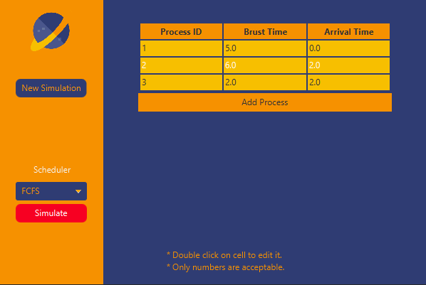
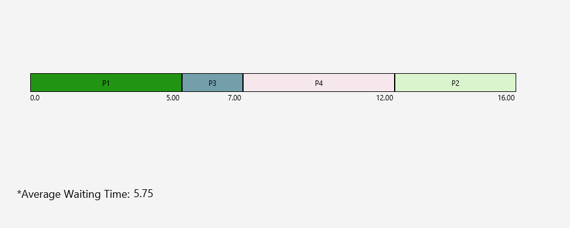

# Saturn Scheduler
Saturn Scheduler is a Java application that simulates different os processes scheduling algorithms and interruption types. It provides a graphical user interface for configuring scheduling options, adding processes, and simulating the scheduler's behavior. The application supports scheduling algorithms such as FCFS (First-Come, First-Served), SJF (Shortest Job First), Priority, and Round Robin.
## Table of Contents

- [Introduction](#introduction)
- [Features](#features)
- [Getting Started](#getting-started)
  - [Prerequisites](#prerequisites)
  - [Installation](#installation)
- [Usage](#usage)
- [Screenshots](#Screenshots)

## Introduction

The Saturn Scheduler is designed to help you understand different scheduling algorithms and their effects on process execution. With this application, you can:

- Add and modify processes with specific properties such as execution time, arrival time, and priority.
- Choose from a variety of scheduling algorithms, including First-Come-First-Serve (FCFS), Shortest Job First (SJF), Priority, and Round Robin.
- Simulate the scheduling process and visualize it using a Gantt chart.
- Analyze the average waiting time of the processes based on the chosen scheduling algorithm.

The application is built using Java and JavaFX, providing a user-friendly interface for easy interaction and simulation.

## Features

- Add and modify processes: The application allows you to create and edit processes with properties such as execution time, arrival time, and priority.

- Multiple scheduling algorithms: Choose from different scheduling algorithms, including FCFS, SJF, Priority, and Round Robin, to observe the effects on process execution and waiting times.

- Gantt chart visualization: The simulation generates a Gantt chart to visualize the execution timeline of processes.

- Average waiting time calculation: The application calculates and displays the average waiting time of the simulated processes based on the chosen scheduling algorithm.

## Getting Started

### Prerequisites

To run the Scheduler Simulator, make sure you have the following prerequisites installed on your system:

- Java Development Kit (JDK) 8 or higher
- JavaFX 8 or higher

### Installation

1. Clone the repository:

   ```bash
   git clone https://github.com/abdelrhmankadry/saturn-scheduler.git
   ```

2. Build the project using your preferred Java build tool (e.g., Maven or Gradle).

3. Run the application using the following command:

   ```bash
   java -jar "Saturn Scheduler.jar"
   ```

## Usage

1. Launch the Scheduler Simulator application.

2. Add processes by clicking the "Add Process" button and filling in the required details.

3. Choose a scheduling algorithm from the drop-down menu (FCFS, SJF, Priority, or Round Robin).

4. Configure any additional options specific to the selected scheduling algorithm (e.g., time quantum for Round Robin).

5. Click the "Simulate" button to start the simulation.

6. The simulation will generate a Gantt chart representing the execution timeline of the processes.

7. View the average waiting time of the processes displayed in the application.

8. Analyze the results and observe the differences in process execution based on the chosen scheduling algorithm.

## Screenshots


